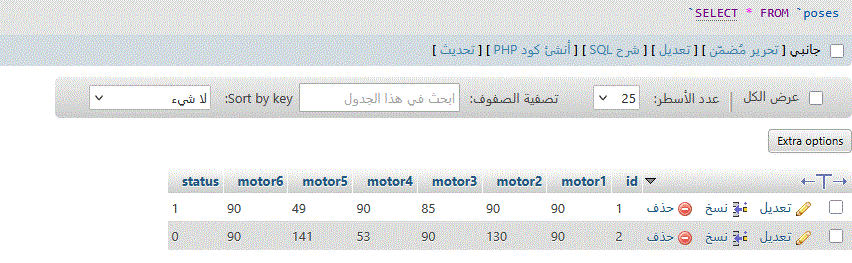
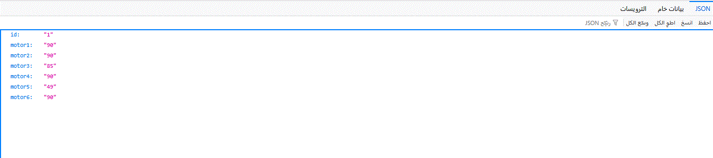

# robot_arm_project

# 🤖 مشروع التحكم في ذراع روبوتية عبر الويب

## 📌 المتطلبات الأساسية
تم تنفيذ المشروع باستخدام HTML, CSS, JavaScript, PHP وقاعدة بيانات MySQL.

---

## ✅ 1. تصميم واجهة تحكم
تم إنشاء صفحة ويب تحتوي على:
- 6 سلايدرات تمثل محركات الذراع.
- أزرار لحفظ، إعادة تعيين، وتشغيل الوضعيات.
- جدول يعرض جميع الوضعيات المحفوظة من قاعدة البيانات.

---

## ✅ 2. إنشاء قاعدة البيانات
تم إنشاء قاعدة بيانات باسم `robot_db` وجدول باسم `poses` يحتوي على الأعمدة التالية:
- motor1, motor2, ..., motor6
- status لتحديد حالة الوضعية (0=عادية، 1=جاهزة للتشغيل)

---

## ✅ 3. إنشاء get_run_pose.php
تم إنشاء ملف PHP يقوم بجلب آخر وضعية حالتها `status = 1` بصيغة JSON ليتم قراءتها من ESP32 أو أي متحكم.

---

## ✅ 4. إنشاء update_status.php
ملف مسؤول عن تعيين `status = 0` لوضعية معينة بعد تنفيذها، ويتم استخدامه عادةً من المتحكم بعد إتمام الحركة.

---
